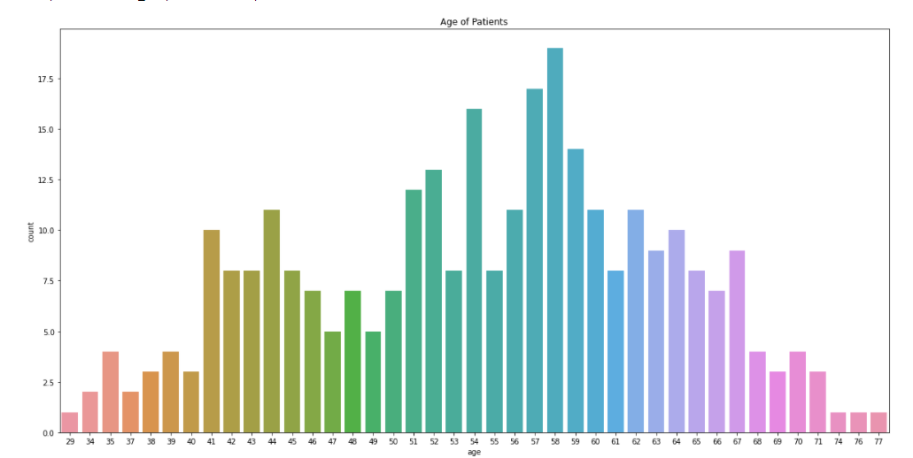
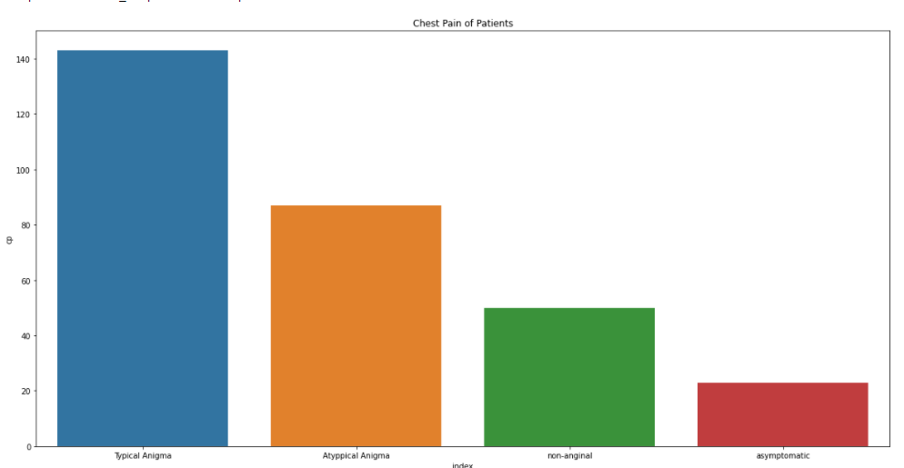

# Heart Attack Risk predictor
Main Aim of this project is to predict whether a person is having a risk of heart attack or not, using Automated Machine Learning Techniques. 

## Table of Content
  * [Problem Statement](#problem-statement)
  * [Approach](#approach)
  * [Technologies Used](#technologies-used)
  * [Installation](#installation)
  * [Bugs & Logs](#bugs--logs)
  * [Contributors](#contributors)





## Problem Statement
A heart attack occurs when one or more of your coronary arteries becomes blocked. Over time, a buildup of fatty deposits, including cholesterol. form substances called plaques, which can narrow the arteries (atherosclerosis). This condition, called coronary artery disease, causes most heart attacks. 


EvalML an open-source AutoML library written in python that automates a large part of the machine learning process and we can easily evaluate which machine learning pipeline works better for the given set of data. 

## Approach
Data Exploration : I started exploring dataset using pandas,numpy,matplotlib and seaborn.

Data visualization : Ploted graphs to get insights about dependend and independed variables.

Feature Engineering : Removed missing values and created new features as per insights.

Model Building & Testing : Tried many machine learning algorithms and checked the base accuracy to find the best fit.

Pickle File : Selected model as per best accuracy and created pickle file.

## Technologies Used
 
   1. Python 
   2. Sklearn
   3. Evalml
   4. SVM
   5. GridSearchCV
   6. Pandas, Numpy 

## Dataset
[Download here](https://github.com/hrishikeshkini/Heart-Attack-Risk-Predictor-with-AutoML/blob/main/heart.csv)

## Installation
Click here to install [python](https://www.python.org/downloads/). To install the required packages and libraries, run this pip command in the project directory after cloning the repository:
```bash
git clone https://github.com/hrishikeshkini/pima-indians-diabetes.git
pip install -r requirements.txt
```
If pip is not already installed, Follow this [link](https://pip.pypa.io/en/stable/installation/)

## Bugs & Logs

1. If you find a bug, kindly open an issue and it will be addressed as early as possible. [Open](https://github.com/hrishikeshkini/pima-indians-diabetes/issues)
2. Under localhost, logging is performed for all the actions and its stored onto logs.txt file
3. When the app is deployed on heroku, logs can be viewed on  heroku dashboard or CLI.

## Contributors
  [Hrishikesh Kini](https://github.com/hrishikeshkini)
